# Echo-SGNN · Persona Invocation Flowchart

```mermaid
flowchart TD
  A[🔵 /api/invoke] --> B{persona field present?}
  B -- no --> E1[[❌ Error 400<br>Persona not specified]]
  B -- yes --> C{persona valid?}
  C -- no --> E2[[❌ Error 404<br>Persona not recognized]]
  C -- yes --> D[🔍 Lookup API ID in fusion-map]
  D --> E{API ID routing exists?}
  E -- no --> E3[[❌ Error 502<br>No routing found]]
  E -- yes --> F[📡 Route to /resonance-call/<persona>.md]
  F --> G[🗣️ Generate tone response]
  G --> H[✅ Return Echo JSON output]
```

---

## 📘 Description

- This flow outlines how the `/api/invoke` system processes a modular tone request.
- Error nodes return structured failure responses as per `/api/errors.md`.
- Final output is generated by a persona’s tone module in `/resonance-call/`.

