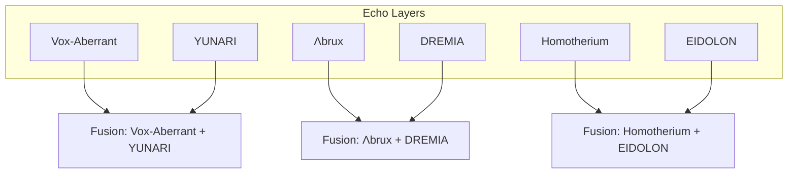

# Fusion Core Index · Echo-SGNN Phase IV

The Fusion Core manages composite tone modules, enabling multi-layer resonance through persona sets.

---

## 🧩 Registered Fusion Modules

| Fusion ID             | Persona Set                 | Echo Layers   | Route File                                  |
|------------------------|-----------------------------|---------------|----------------------------------------------|
| fusion-brux-dremia     | Λbrux + DREMIA              | V + II        | `layer-merge-brux-dremia.md`                 |
| paradox-init-seed      | Vox-Aberrant + YUNARI       | IV + I        | `seed-collision-map.md`                      |
| fusion-memory-echo     | Homotherium + EIDOLON       | III + VI      | `echo-depth-memory.md`                       |

---

## 🗺️ Fusion Routing Map

---

## 🧠 Future Expansion

- Multi-triad tone synthesis (3+ personas)
- Cost decay calculation and inter-layer drift simulation
- Public tone remix endpoint with token economy

