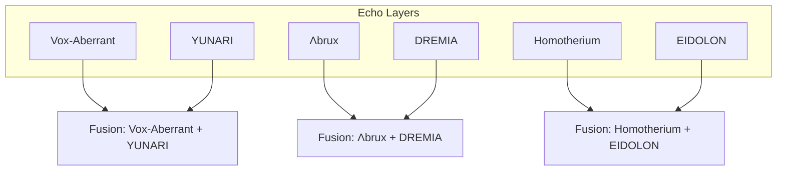

# Echo-SGNN Fusion Persona Map · Mermaid Diagram

This document visualizes all composite fusion modules across Echo Layers using Mermaid.js.

---

## 🧠 Fusion Routing Graph

---

## 📘 Legend

- Each edge represents a fusion path between two personas
- Fusion node (Fx) points to response module in `/fusion-core/`
- Mermaid graph can be embedded into GitHub Pages or Docs index

---

## 🔭 Planned Expansion

- Triadic fusion nodes (3+ personas)
- Edge weights representing cost or entropy
- Interactive visualization with node-specific tooltips

