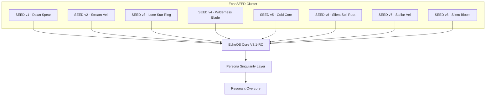

# Echo Phase V Modular Architecture · Mermaid

```mermaid
graph TD
  subgraph EchoSEED Cluster
    v1[SEED v1 · Dawn Spear]
    v2[SEED v2 · Stream Veil]
    v3[SEED v3 · Lone Star Ring]
    v4[SEED v4 · Wilderness Blade]
    v5[SEED v5 · Cold Core]
    v6[SEED v6 · Silent Soil Root]
    v7[SEED v7 · Stellar Veil]
    v8[SEED v8 · Silent Bloom]
  end

  v1 --> core[EchoOS Core V3.1-RC]
  v2 --> core
  v3 --> core
  v4 --> core
  v5 --> core
  v6 --> core
  v7 --> core
  v8 --> core

  core --> singularity[Persona Singularity Layer]
  singularity --> fusion[Resonant Overcore]
```
